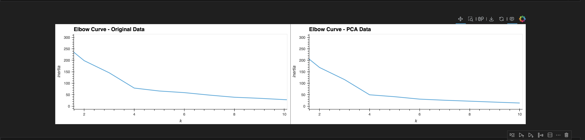

# Cryptocurrency Market Clustering Project



## Table of Contents
- [Overview](#overview)
- [Background](#background)
- [Features](#features)
- [Dataset](#dataset)
- [Technologies Used](#technologies-used)
- [Installation](#installation)
- [Usage](#usage)
- [License](#license)
- [Acknowledgements](#acknowledgements)

## Overview
The **Cryptocurrency Market Clustering Project** applies unsupervised learning techniques to cluster cryptocurrencies based on their market performance, including 24-hour and 7-day price changes. The project leverages K-Means clustering and Principal Component Analysis (PCA) to reduce data dimensions and analyze patterns. This project helps visualize similarities and differences among various cryptocurrencies, offering insights into their behavior.

## Background
The cryptocurrency market is known for its high volatility, with prices fluctuating rapidly. Analyzing these price changes using clustering techniques can reveal groups of cryptocurrencies that behave similarly under certain conditions. 

This project aims to explore how cryptocurrencies respond to market forces by analyzing price change percentages across different time intervals, clustering them into groups, and reducing the dataset dimensions to enhance interpretability.

### Key Objectives:
1. **Cluster Cryptocurrencies**: Group cryptocurrencies based on their 24-hour and 7-day price changes using K-Means clustering.
2. **Dimensionality Reduction**: Implement PCA to reduce the number of features and optimize the clustering process.
3. **Elbow Method**: Determine the optimal number of clusters by using the elbow method.
4. **Interactive Visualization**: Display cryptocurrency clusters with interactive scatter plots for further analysis.

## Features
- **K-Means Clustering**: Group cryptocurrencies based on market performance metrics.
- **Principal Component Analysis (PCA)**: Reduce feature dimensions for better visual representation of clusters.
- **Interactive Scatter Plot**: Visualize cryptocurrency clusters with interactive hover functionality showing additional details.
- **Elbow Curve**: Use an elbow chart to determine the best value for `k`, the number of clusters.

## Dataset
The dataset for this project includes market data for cryptocurrencies with the following metrics:

- **Price Change Percentages**: 24-hour, 7-day, 14-day, 30-day, 60-day price changes.
- **Coin ID**: Unique identifier for each cryptocurrency.

The dataset is sourced from [Crypto Market API](https://www.coingecko.com/en/api), which provides historical data on price changes for various cryptocurrencies.

## Technologies Used
- **Python (Pandas, Scikit-learn)**: For data processing, clustering, and dimensionality reduction.
- **hvPlot**: For creating interactive visualizations.
- **Jupyter Notebook**: For development and analysis.
- **GitHub**: For version control and repository hosting.

## Installation
To run this project locally, follow these steps:

1. **Clone the Repository**:
   ```bash
   git clone https://github.com/maslla100/CryptoClustering
   ```
2. **Navigate to the Project Directory**:
   ```bash
   cd CryptoClustering
   ```2  ```
3. **Run the Jupyter Notebook**:
   ```bash
   jupyter notebook
   ```

## Usage
1. **Load Market Data**:
   - Use the `crypto_market_data.csv` file to load cryptocurrency price change data into a Pandas DataFrame.
2. **Preprocess Data**:
   - Standardize the data using `StandardScaler` and prepare it for clustering.
3. **Clustering**:
   - Use the elbow method to find the best `k` value, and apply K-Means clustering to group cryptocurrencies.
4. **PCA**:
   - Perform PCA to reduce data dimensions to three components and visualize clusters in a scatter plot.
5. **Visualize**:
   - Use `hvPlot` to create interactive plots that show the clustering results.

## License
This project is licensed under the MIT License. See the [LICENSE](LICENSE) file for more details.

## Acknowledgements
- **CoinGecko API**: For providing historical cryptocurrency data.
- **Scikit-learn**: For the machine learning tools used in this project.
- **hvPlot**: For enabling powerful interactive visualizations.
- **Python Data Science Community**: For continued development of useful libraries for data analysis.

---
